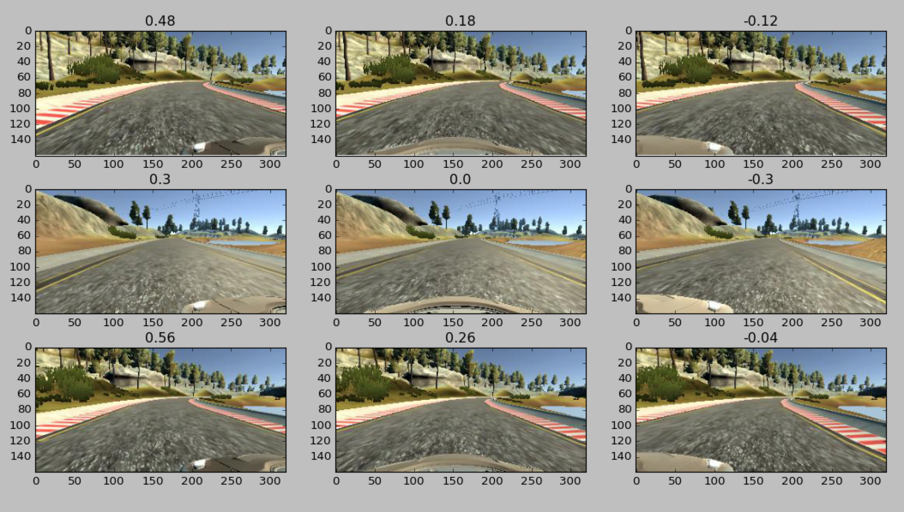

# The Car Drives Itself #

## Overview ##
Deep neural network to drive a car in a simulator. For a deeper look at my process, check out [my article on Medium](https://medium.com/@billzito/my-first-self-driving-car-e9cd5c04f0f2#.d4ww3vea7). 

Model largely copied from [Nvidia's paper](images.nvidia.com/content/tegra/automotive/images/2016/solutions/pdf/end-to-end-dl-using-px.pdf). Trained via 8k images on the track, which were augmented to become 48k images. 

All made possible by Udacity's Self-driving Car Nanodegree.

1. Used Udacity's images of a car driving on the track normally and recovering from the left and right sides
1. The model, a mix of convolutional2d layers, relu activations, and fully connected layers, is trained for ~16 epochs on 45k training images (see model section for more details)
1. Drive.py sends the predicted steering angle while the simulator runs
1. To run the model, clone the code and run python3 drive.py successful_models/nvidia_33_17.json (python3, opencv, and tensorflow required)

## Files ##
1. model.py - The script used to create and train the model.
1. drive.py - Sends information to the simulator about throttle and steering angle.
1. process_data.py - Resizes and saves the images and steering angles, as well as augmenting them in various ways.
1. model.json - The model architecture.
1. model.h5 - The model weights.
1. successful_models - A list of the models and weights for models that get around the track successfully.

## Methodology ##
1. First, I tried recording my own data and adding several image processing steps with a copy of Comma.ai's model. I realized that I was trying to change too many things at once, and so tested adding one image processing step at a time until I figured out that flipping images horizontally and adding left and right camera images were two of the only steps that improved my car's driving.
1. I created a copy of Nvidia's model based on their paper (copying their convolutional and fully connected layers almost exactly). Their model performed well with similar constraints, and was much smaller than Comma.ai's model, so I knew it would reduce the time it took me to test subsequent models. 
1. I predicted that dropout would be necessary to prevent the model from overfitting, especially given the lower complexity of my simulator images compared to real-world images for Nvidia. I found out that a dropout of .5 worked best through guess and test.
1. I saw that the validation score leveled off at around epoch 15, suggesting that the model was overfitting after that point, and testing epochs 10-20 found that epoch 15 performed the best (getting to the turn after the bridge).
1. I lowered the learning rate to .0001 and trained the model for 5 more epochs, prediction that this would allow me to reduce the validation score without overfitting. The model with a couple epochs 
1. I knew that my data was biased towards '0' steering angles, so I tried correcting by adding a 1.3x multiplier (found by guess and test) in the drive.py file to each steering angle. This allowed the car to make steeper turns. 

## Data Processing (process_data.py) ##
Left and right camera images are saved with +.3 and -.3 steering angle changes respectively to generate more images.

Wheras angles were strongly biased towards 0 with only center images, using left and right camera images gives some broadening of the curve (with -.3 and .3 now being high as well)

Images are resized to (200, 66) to be in the correct size for the Nvidia model.

During model training, half of the images are flipped horizontally with their steering angles multiplied 
by -1 to prevent overfitting to the track's bias in one direction.

(Processing steps not used): brightness augmentation, translation, croping, zero-normalization.

## Model (model.py) ##

1. 5 convolutional2d layers increase the feature depth (see image for hyperparameters).
1. Relu activations find non-linear relationships between layers.
1. Three fully connected layers added at end, eventually outputing a steering angle.
1. Using adam optimizer, mean squared error minimized (distance from predicted steering angle and actual).
1. 48k images (after processing) trained for 15 epochs with batch size 128 at .001, then for a couple more at .0001

## Acknowledgements ##
1. Thank you to Udacity for selecting me for the nanodegree and helping me meet like-minded people.
1. I drew inspiration for each step of the process from Nvidia's paper and  Comma.ai's model.
1. Several other students wrote good Medium pieces explaining their methodolgies. In particular, I am grateful for pieces by [Vivek](https://chatbotslife.com/using-augmentation-to-mimic-human-driving-496b569760a9#.zh7bo8734), [Mengxi](https://medium.com/@xslittlegrass/self-driving-car-in-a-simulator-with-a-tiny-neural-network-13d33b871234#.df7dce6ih), and [Denise](https://medium.com/@deniserjames/denise-james-bsee-msee-5beb448cf184#.fsprdy8ok) 
